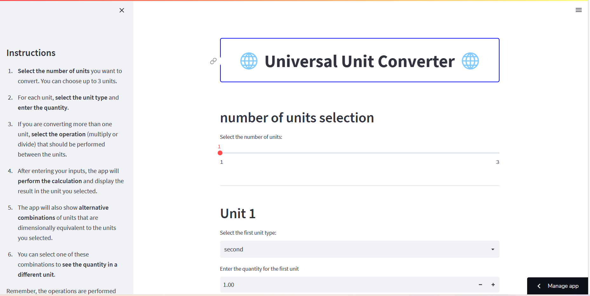

# Universal Unit Converter

This is a web-based application for converting between different units. It uses Streamlit and the Pint library for unit conversion. You can access the app [here](https://unit-converter-engineering.streamlit.app/).

## Usage

The Universal Unit Converter supports conversion between up to three different units. To use it:

1. Select the number of units to convert.
2. For each unit, select the type and enter the quantity.
3. If converting more than one unit, select the operation (multiply or divide) to perform between units.
4. The app will perform the calculation and display the result in the selected unit.
5. The app also shows alternative combinations of units that are dimensionally equivalent to the selected units. You can select one of these combinations to see the quantity in a different unit.

## Running the App Locally

If you want to run the app locally:

1. Clone this repository.
2. Install the required Python packages: `pip install -r requirements.txt`.
3. Run the Streamlit app: `streamlit run app.py`.

## Contributing

Contributions are welcome. Please submit a pull request or create an issue to discuss proposed changes.

## License

This project is licensed under the terms of the MIT license.
